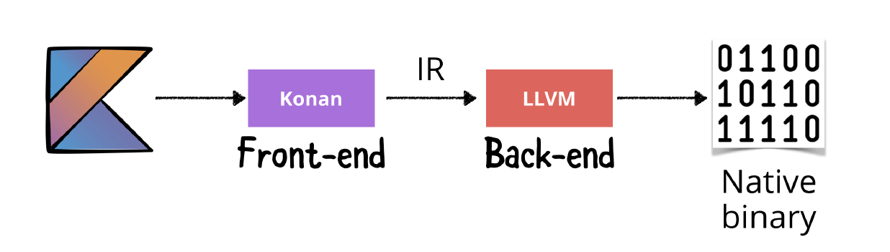
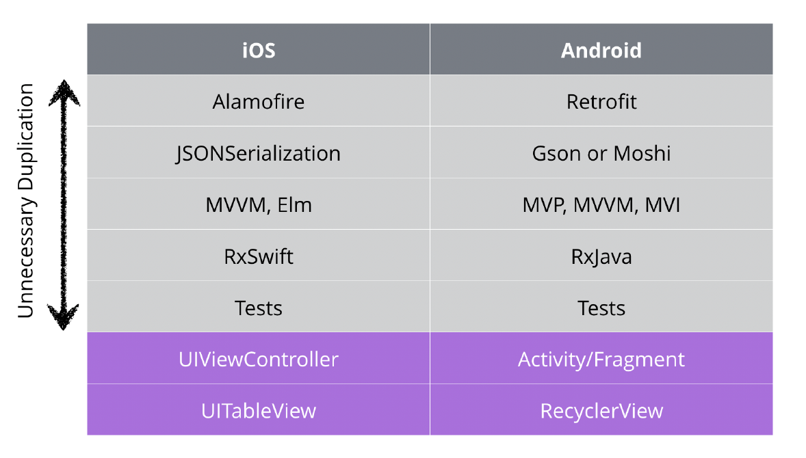
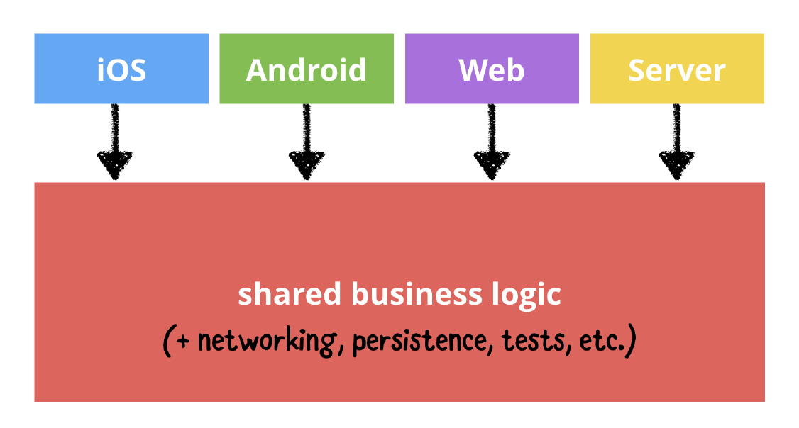
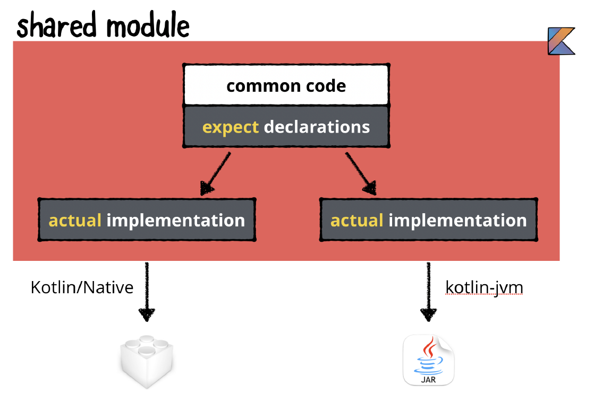

# Kotlin/Native
The technology used to bring Kotlin beyond the JVM. Allows you to compile Kotlin code outside of virtual machines, resulting in
self-contained binaries that are native to the environment in which they're run. The Kotlin/Native compiler was announced in 2017.

## Konan and LLVM
The Kotlin/Native compiler itself is named Konan. Konan handles the front-end of
the process, compiling the Kotlin source code into an Intermediate Representation
(IR) that is the input to the back-end of the process. Kotlin/Native leverages the
LLVM compiler for the back-end. LLVM is a set of components that optimize IR
code and compile it to machine-dependent binaries.

By combining Konan with LLVM, Kotlin/Native lets you produce native executables
from your Kotlin code. In theory, Kotlin/Native can be used on any platform
supported by LLVM. The process through which Kotlin/Native takes Kotlin code and turns it into native code:

## Kotlin Standard Library
When compiling with Kotlin/Native, the executable file can be larger due to the fact that the Kotlin standard library is statically linked in to the executable file.

# Kotlin Multiplatform
With the size of an app, the amount of code duplication grows essentially linearly as would the
amount of time and effort to first produce and then maintain two apps for the two platforms - Android/IOS. Typical libraries used for networking, serialization and data storing for each platform that bring the unnecessary duplication:

## Sharing Code
Reduce the amount of duplication by putting common logic and functionality into one module or shared project. The shared module includes business logic,and things like networking code, data parsing, data peristence, and more.
You can use various architectural patterns. With Clean Architecture, the inner layers would be
shared, and only the outermost layer would be unique to a given platform. 

## Expect/Actual Mechanism
Compiling the entire shared project for all platforms is not the approach taken by
Kotlin Multiplatform. Instead a certain amount of code is common to all platforms,
but some amount of the shared code is unique to each platform. The expect/actual
mechanism has been added to Kotlin to allow for this.


You can think of `expect` as an interface in Kotlin. You use `expect` to say that the shared common code expects
something to be available in the compiled code for all platforms. You then use
`actual` to give the actual version of that something for each separate platform.

## Other Cross-Platform Frameworks
There are many frameworks targeting on reducing the duplicated code such as Flutter. Reasons why cross-platfrom frameworks are not adopted:

* poor performance of the resulting apps
* inconsistencies with the native user interfaces
* an inability to stay up-to-date with the latest iOS and Android features
* developer loyalty to and expertise with the native SDK

Kotlin Multiplatform is not a framework at all. It's more of an approach to mobile app development. Advantages over the other approaches:

* Android developers can leverage their Kotlin skills within shared code
* As the UI code remains native to platforms, the UIs can take advantage of the latest improvements
* Performance matches the performance of purely platform-specific native apps
* On a larger app you can divide your team up into groups that work in different areas - shared module, Android/IOS UI

# Technologies & Libraries
* MOKO - share resources and architecture components such as ViewModel, [template](https://github.com/icerockdev/moko-template)
* SQLDelight - local data storing
* Kotlin Serialization - parsing
* Ktor - networking
* [FirestoreKMP](https://github.com/touchlab-lab/FirestoreKMP) - library wrapping the Firestore operations to use in shared module
* Koin (or Kodein) - dependency injection

# Sources
* Oficial documentation - [overview](https://kotlinlang.org/docs/multiplatform.html), [intro](https://kotlinlang.org/docs/mpp-intro.html), [getting started](https://kotlinlang.org/docs/mobile/getting-started.html), [hands on](https://play.kotlinlang.org/hands-on/Networking%20and%20Data%20Storage%20with%20Kotlin%20Multiplatfrom%20Mobile/01_Introduction): networking and data storage
* Ktor server in KotlinKonf app - [project](https://github.com/JetBrains/kotlinconf-app)
* KMP with MVI in DroidKaigi app - [project](https://github.com/DroidKaigi/conference-app-2021#Tech-Stacks)
* KMP with MVVM and Clean architecture (Moko for shared ViewModel) - [article](https://proandroiddev.com/kotlin-multiplatform-mvvm-clean-architecture-f20b99f90b95), [project](https://github.com/jarroyoesp/KotlinMultiplatform_MVVM)
* KMP with MVP and Clean architecture - [article](https://proandroiddev.com/clean-architecture-example-with-kotlin-multiplatform-c361bb283fd0)
* KMP with MVVM and Firebase in shared module - [article](https://proandroiddev.com/kotlin-multiplatform-firebase-mvvm-4cdcddd98893), [project](https://github.com/jarroyoesp/KotlinMultiplatform_Firebase_MVVM)
* KMP IceRock [codelabs](https://codelabs.kmp.icerock.dev)

### Included in this document
* Ray Wenderlich - Kotlin Apprentice - Section IV/Chapter 26 - [book](https://www.raywenderlich.com/books/kotlin-apprentice/v2.0/)

